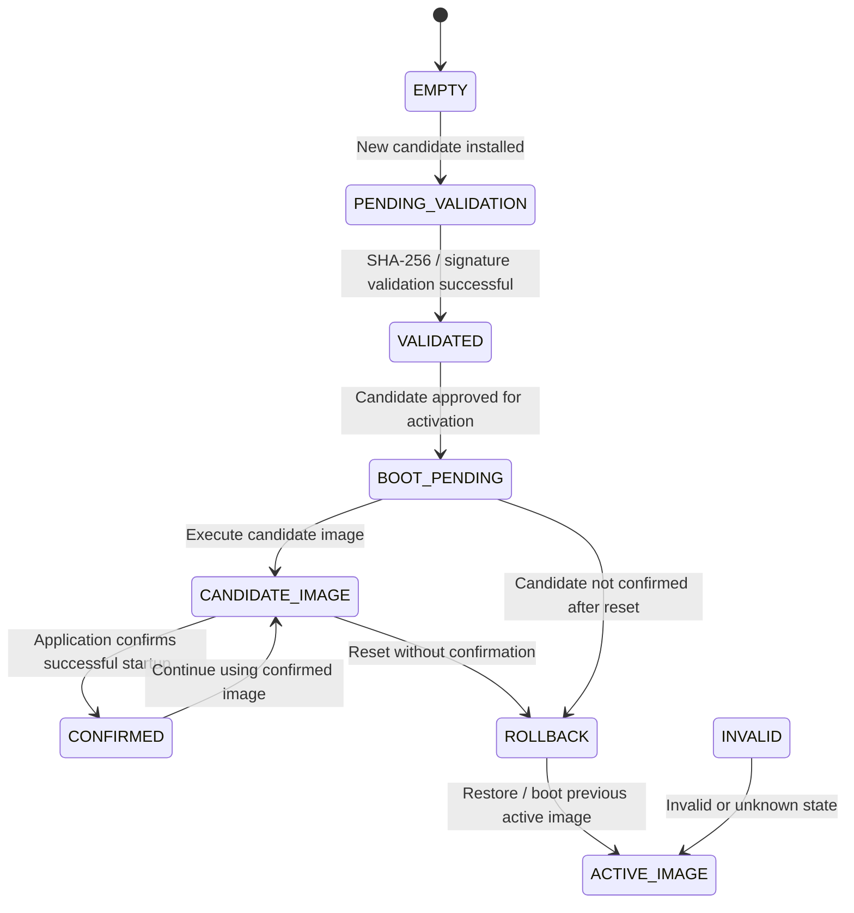

# Candidate Update State Machine

## 1. Purpose

This document defines the planned persistent update-state mechanism for the future production-oriented FOTA enhancement.

The current FOTA implementation does not use persistent update-state handling. The state machine described here will be introduced after Digital Signature Authentication and candidate-to-active firmware activation are implemented.

The purpose of the state machine is to track the candidate firmware lifecycle across resets and determine whether the newly activated firmware should remain active or be rolled back.

---

## 2. Candidate Update State Machine



---

## 3. State Definitions

| State                | Meaning                                                                    |
| -------------------- | -------------------------------------------------------------------------- |
| `EMPTY`              | No candidate update is pending                                             |
| `PENDING_VALIDATION` | Candidate firmware has been installed and is waiting for validation        |
| `VALIDATED`          | Candidate firmware has passed the required integrity/authentication checks |
| `BOOT_PENDING`       | Candidate firmware is approved for trial activation                        |
| `CANDIDATE_IMAGE`    | Candidate firmware is currently being executed                             |
| `CONFIRMED`          | Candidate firmware has been successfully confirmed by the application      |
| `ROLLBACK`           | Candidate firmware failed to boot successfully or was not confirmed        |
| `INVALID`            | Stored update state is invalid or unknown                                  |
| `ACTIVE_IMAGE`       | Previous known-good firmware is executed                                   |

---

## 4. Main Flow

```text
EMPTY
  ↓
PENDING_VALIDATION
  ↓
VALIDATED
  ↓
BOOT_PENDING
  ↓
CANDIDATE_IMAGE
  ↓
Application Confirmation
  ↓
CONFIRMED
```

---

## 5. Candidate Boot Failure

```text
BOOT_PENDING
      ↓
CANDIDATE_IMAGE
      ↓
Reset / No Confirmation
      ↓
ROLLBACK
      ↓
ACTIVE_IMAGE
```

The Bootloader will use the persistent update state to determine that the candidate firmware was not successfully confirmed and will revert to the previous known-good firmware.

---

## 6. Candidate Confirmation

After the candidate firmware starts successfully, the application will provide an explicit confirmation.

```text
CANDIDATE_IMAGE
      ↓
Application Startup
      ↓
Application Confirmation
      ↓
CONFIRMED
```

The confirmation state must be stored persistently so that it survives subsequent resets.

---

## 7. Invalid State Handling

An unexpected or invalid persistent state shall not cause the Bootloader to execute an unknown firmware image.

```text
INVALID
   ↓
ACTIVE_IMAGE
```

The Bootloader will fall back to the previous known-good image or enter the defined recovery path according to the final implementation.

---

## 8. Persistent Storage

The future implementation will allocate a dedicated non-volatile storage area for update-state information.

The persistent state may include information such as:

* Current update state
* Candidate image identifier
* Firmware version
* Boot-attempt information
* Confirmation status
* Recovery information

The exact storage format and Flash allocation will be defined during the FOTA enhancement phase.

---

## 9. Design Considerations

The state machine will support:

* Trial boot of newly activated firmware
* Explicit application confirmation
* State persistence across reset
* Detection of unsuccessful candidate boots
* Automatic rollback
* Recovery from interrupted updates
* Power-loss resilience
* Integration with authenticated firmware activation

The implementation will be designed so that an unconfirmed candidate cannot permanently replace the known-good firmware without successful confirmation.

---

## 10. Implementation Status

**Status: Planned Future Enhancement**

This state machine is currently a design specification only.

Persistent update-state handling, pending/confirmed image management, candidate-to-active activation, rollback, and power-loss recovery will be implemented after Digital Signature Authentication as part of the production-oriented FOTA enhancement phase.
