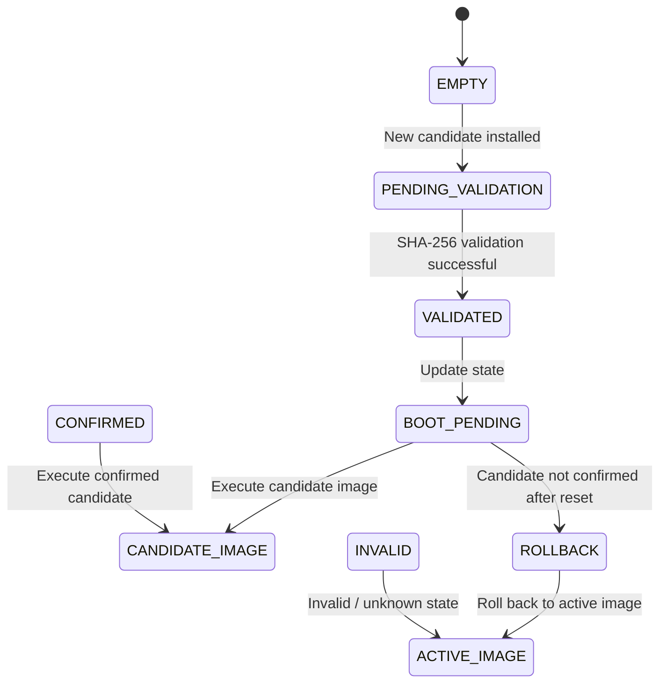

# Candidate Update State Machine




| State                | Meaning                                                 |
| -------------------- | ------------------------------------------------------- |
| `EMPTY`              | No candidate update is pending                          |
| `PENDING_VALIDATION` | Candidate image is installed and waiting for validation |
| `VALIDATED`          | Candidate image passed integrity validation             |
| `BOOT_PENDING`       | Candidate is approved for boot testing                  |
| `CONFIRMED`          | Candidate successfully confirmed by the application     |
| `ROLLBACK`           | Candidate boot was unsuccessful or not confirmed        |
| `INVALID`            | Invalid or unknown update state                         |
| `CANDIDATE_IMAGE`    | Candidate firmware is executed                          |
| `ACTIVE_IMAGE`       | Current known-good firmware is executed                 |


## Main Flow
```text
EMPTY
  ↓
PENDING_VALIDATION
  ↓
VALIDATED
  ↓
BOOT_PENDING
  ↓
CANDIDATE_IMAGE
```
## Candidate Boot Failure
```text
BOOT_PENDING
  ↓
ROLLBACK
  ↓
ACTIVE_IMAGE
```
## Candidate Confirmation
```text
CONFIRMED
  ↓
CANDIDATE_IMAGE

Invalid State
INVALID
  ↓
ACTIVE_IMAGE
```
