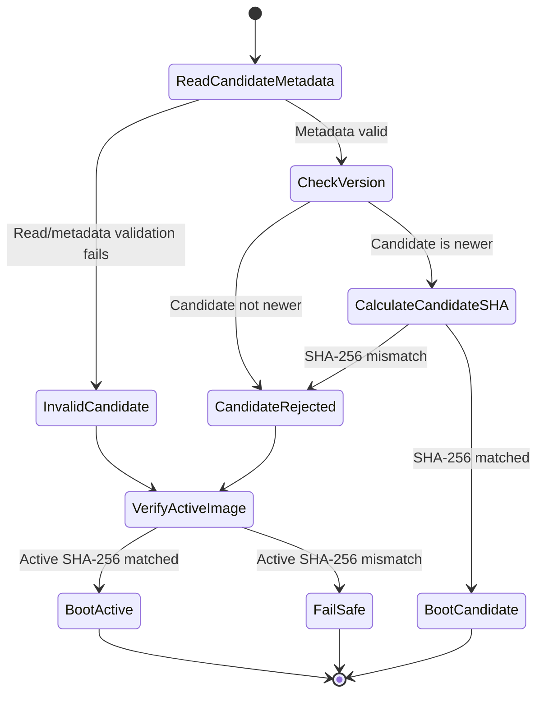
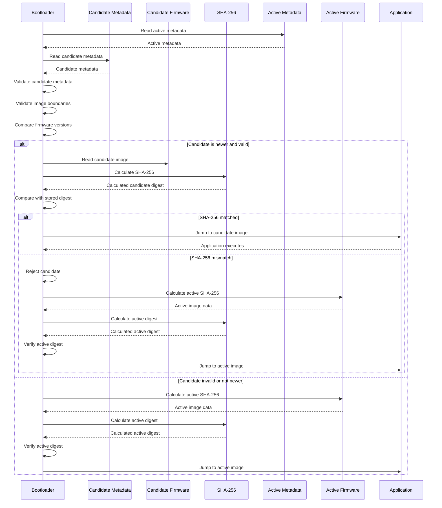

# STM32-Project-05-Secure-Boot

A practical implementation of a Secure Boot and dual-image firmware update architecture for an STM32F407 embedded system. The project focuses on firmware integrity verification using SHA-256, firmware metadata validation, secure application handover, candidate/active image management, and FOTA-oriented fallback handling.

Digital-signature-based firmware authenticity is planned as a future security extension.

## Project Objective

The goal of this project is to design and implement a secure firmware boot and update mechanism that verifies firmware integrity before execution and separates candidate firmware from the currently active firmware.

The implementation is developed incrementally, with SHA-256-based firmware integrity verification as the core security mechanism. The dual-image architecture provides the foundation for safer firmware update handling while preserving the currently active firmware during candidate validation.

## Current Secure Boot Flow

1. MCU Reset
2. Bootloader starts execution
3. Read active firmware metadata
4. Validate active metadata and application image boundaries
5. Calculate the active firmware SHA-256
6. Compare the calculated digest with the stored reference digest
7. Boot the active application when integrity verification succeeds
8. Enter the defined failure-handling path when active firmware integrity verification fails

## Current Dual-Image / FOTA Architecture

The firmware update architecture uses separate candidate and active image regions so that candidate firmware can be independently validated without overwriting the currently active application.

```text
STM32F407 Internal Flash
|
+-- Sector 0-1 : Bootloader
|
+-- Sector 2   : Active Image Metadata
|
+-- Sector 3   : Candidate Image Metadata
|
+-- Sector 4   : Candidate Firmware
|
+-- Sector 5   : Active Firmware
```

## Current candidate-image validation flow

1. Read candidate firmware metadata
2. Validate candidate metadata
3. Validate candidate image boundaries
4. Compare candidate firmware version with the active firmware version
5. Calculate the candidate SHA-256 independently in the bootloader
6. Compare the calculated digest with the candidate reference digest
7. Reject the candidate when metadata, version, or integrity verification fails
8. Preserve the existing active firmware while evaluating the candidate
9. Boot the candidate directly from its candidate image location when integrity verification succeeds
10. Fall back to the active firmware when the candidate is rejected

### Candidate Image Validation State Flow



### Candidate Image Validation Sequence



The diagrams describe the **current implementation only**. Persistent update state, pending/confirmed handling, candidate-to-active programming, and rollback are intentionally excluded from this flow and remain future enhancements.

## Implemented Security Features

* STM32 bootloader implementation
* Bootloader/application memory partitioning
* Active and candidate firmware image separation
* Firmware metadata management
* Application image boundary validation
* Firmware version validation
* SHA-256 implementation
* SHA-256 test-vector validation
* SHA-256 validation of firmware stored in STM32 flash
* Candidate firmware SHA-256 verification
* Active firmware SHA-256 verification
* Secure application handover
* Invalid metadata handling
* Invalid/corrupted firmware handling
* Candidate/active image management
* Active-image fallback when candidate validation fails
* FOTA-oriented dual-image validation flow

## Planned Security Extension

Digital signature verification will be added after completion of the current SHA-256 and firmware-update validation flow.

SHA-256 provides firmware integrity verification by detecting changes to the firmware image. Digital signatures will extend the design by providing firmware authenticity and enabling verification that the firmware originates from a trusted signing source.

## Verification & Testing

Validation is performed incrementally during implementation.

Current verification areas include:

* SHA-256 standard test vectors
* Empty and single-block inputs
* Padding-boundary test cases
* Multi-block SHA-256 inputs
* STM32 flash image hashing
* Active-image SHA-256 verification
* Candidate-image SHA-256 verification
* Candidate hash mismatch handling
* Active metadata validation
* Candidate metadata validation
* Firmware version comparison
* Application memory boundary validation
* Candidate/active image boot behavior
* Active-image fallback handling

Test evidence is maintained separately using validation test cases, debugger checkpoints, LED status indication, and screenshots.

## Hardware & Software

* **MCU:** STM32F407
* **Architecture:** ARM Cortex-M4
* **Language:** Embedded C
* **IDE:** STM32CubeIDE
* **Debugging:** ST-LINK / SWD / GDB
* **Build / Image Handling:** Post-build processing and Python
* **Version Control:** Git / GitHub

## Repository Structure

```text
STM32-Project-05-Secure-Boot/
├── Application/
│   └── Main application firmware
├── Candidate App/
│   └── Candidate firmware used for dual-image/FOTA testing
├── Firmware/
│   └── STM32F407 bootloader implementation
│       ├── Core/
│       ├── Drivers/
│       ├── Modules/
│       ├── Tools/
│       ├── Debug/
│       ├── STM32F407VGTX_FLASH.ld
│       └── STM32F407VGTX_RAM.ld
├── Docs/
│   └── Project documentation and design notes
├── Validation/
│   └── Test cases, validation results, and evidence
├── LICENSE
└── README.md
```

## Future Enhancements

* Digital signature verification
* Authenticated firmware updates
* Candidate-to-active image programming and activation
* Persistent firmware update state
* Pending/confirmed image handling
* Automatic rollback and recovery
* Power-loss-resilient update handling
* Automated firmware image generation and validation
* ISO 26262-oriented verification
* Increased unit-test coverage and tool-based coverage analysis
