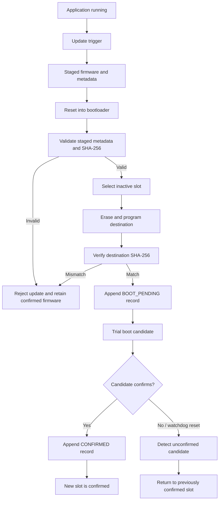

# STM32 Secure Boot: Firmware Integrity Verification Using SHA-256 and A/B FOTA

A practical STM32F407 project implementing a bootloader, SHA-256 firmware integrity verification, and dual-slot A/B firmware updates.

The project demonstrates how a bootloader can validate staged firmware, program an inactive slot, verify the programmed image, trial-boot a candidate, and confirm or roll back based on the candidate's outcome.

## Project Status

### Implemented and functionally tested

- STM32F407 bootloader and application separation.
- Slot-specific firmware builds and memory layouts for Slot A and Slot B.
- Firmware metadata validation, image-size and slot-boundary checks.
- SHA-256 validation of staged firmware and programmed destination images.
- A/B update cycling and inactive-slot selection.
- Metadata records containing sequence information, a record CRC, and a commit marker.
- `BOOT_PENDING` trial-boot handling and application confirmation.
- Recovery to the previously confirmed firmware when a candidate fails to confirm, including the tested watchdog-reset scenario.
- Fail-safe handling when the selected active firmware fails integrity verification.
- A button-based update notification used as a demonstration substitute for an external communication trigger.
- ITM/debugger and LED evidence for the main boot, update, integrity, confirmation, and recovery paths.

### Remaining work and limitations

- Threat modeling and security-hardening review.
- Documentation aligning relevant IEC 62443 cybersecurity practices and ISO 26262 safety concepts with the project. This is not formal certification or a full compliance assessment.
- Final unit-test coverage review and consolidated project documentation.
- Digital-signature verification and trusted-key management.
- A production communication/download mechanism; the current button trigger is a demonstration substitute.
- Additional resilience work and testing for actual power interruption during flash operations and metadata writes.

## Architecture Overview

The architecture separates the incoming firmware image, bootloader decision logic, per-slot metadata, and the two executable firmware slots.

```text
Running application
        |
        | Update available (button used as demonstration trigger)
        v
Download / staging area
        |
        | Reset after staged update is ready
        v
Bootloader
        |
        +--> Read and validate metadata
        +--> Validate staged image and version
        +--> Select inactive firmware slot
        +--> Erase and program destination slot
        +--> Calculate SHA-256 of programmed image
        +--> Append BOOT_PENDING metadata record
        |
        v
Candidate slot trial boot
        |
        +--> Application confirms --> Append CONFIRMED record
        |
        +--> Candidate fails to confirm / watchdog reset
                    |
                    v
             Bootloader rollback to previously confirmed slot
```

The current demonstration uses a button in the running application to set an update-available flag and reset the MCU. This simulates an external notification mechanism such as CAN, Bluetooth, or network-triggered FOTA. It is not itself a network or field-download implementation.

## Flash Memory Architecture

The current memory layout is:

| STM32F407 region | Address / start | Purpose |
|---|---|---|
| Sectors 0–1 | `0x08000000`–`0x08007FFF` | Bootloader |
| Sector 2 | `0x08008000` | Slot A metadata |
| Sector 3 | `0x0800C000` | Slot B metadata |
| Sector 4 | `0x08010000` | Download / staging area |
| Sector 5 | `0x08020000` | Firmware Slot A |
| Sector 6 | `0x08040000` | Firmware Slot B |
| Remaining flash | From `0x08060000` onward | Reserved / available, subject to device and linker configuration |

The metadata and firmware slots are associated with fixed physical slots. Their active and inactive roles change during the update lifecycle.

### Slot-specific firmware builds

Each application image must be linked for the address at which it will execute:

```text
Firmware Slot A
    FLASH origin = 0x08020000
    Vector table = 0x08020000

Firmware Slot B
    FLASH origin = 0x08040000
    Vector table = 0x08040000
```

The bootloader validates the image range and uses the selected slot's start address when transferring control to the application. The application handover must use the matching vector table and reset handler.

## Update and Confirmation Flow

1. The application stages an update and signals that it is available. In the current demonstration, a button press provides this trigger.
2. Following reset, the bootloader reads slot metadata and staged-image metadata.
3. The bootloader validates the staged image, including its expected size, version policy, and SHA-256 digest.
4. The bootloader selects the inactive slot, erases it, and programs the staged image.
5. The bootloader calculates SHA-256 over the programmed destination and compares it with the expected digest.
6. If validation succeeds, the destination is marked `BOOT_PENDING` and selected for trial boot.
7. The candidate application calls `Firmware_Confirm()`. Successful confirmation appends a `CONFIRMED` metadata record.
8. If the candidate fails to confirm and the MCU resets, the bootloader detects the unconfirmed `BOOT_PENDING` state and returns to the previously confirmed firmware according to the implemented recovery policy.

### Update Flow Diagram


```mermaid
flowchart TD
    A[Application running] --> B[Update trigger]
    B --> C[Staged firmware and metadata]
    C --> D[Reset into bootloader]
    D --> E[Validate staged metadata and SHA-256]
    E -->|Invalid| F[Reject update and retain confirmed firmware]
    E -->|Valid| G[Select inactive slot]
    G --> H[Erase and program destination]
    H --> I[Verify destination SHA-256]
    I -->|Mismatch| F
    I -->|Match| J[Append BOOT_PENDING record]
    J --> K[Trial boot candidate]
    K --> L{Candidate confirms?}
    L -->|Yes| M[Append CONFIRMED record]
    M --> N[New slot is confirmed]
    L -->|No / watchdog reset| O[Detect unconfirmed candidate]
    O --> P[Return to previously confirmed slot]
```

## Boot Decision and Fail-Safe Behavior

On reset, the bootloader reads and validates metadata, checks the selected image's memory boundaries, calculates its SHA-256 digest, and compares the calculated digest with the metadata digest.

The current implementation has two distinct recovery paths:

- **Candidate fails to confirm:** When a candidate is in `BOOT_PENDING` and resets before confirmation, the bootloader detects the unconfirmed candidate and rolls back to the previously confirmed firmware. This was tested with candidate firmware that intentionally skips confirmation and stops refreshing the watchdog.
- **Selected active image fails SHA-256:** The current normal-boot path calls `Bootloader_FailSafe()` when the selected active image's digest does not match. It does **not** automatically try the alternate slot in this path. The active-image-corruption test verifies rejection and entry into the configured BootSafe/fail-safe behavior.

A staged-image validation failure should not result in execution of the invalid staged image. The prior confirmed firmware remains the intended boot target when it is still valid.

## Firmware Metadata and Journal

Each slot has associated firmware metadata, represented conceptually as:

```c
typedef struct
{
    uint32_t magic;
    uint32_t image_size;
    uint32_t version;
    uint8_t  sha256[SHA256_DIGEST_SIZE];
    uint32_t update_state;
} firmware_metadata_t;
```

The metadata describes the image stored in a slot. Fixed image boundaries are defined by the bootloader and linker configuration rather than trusted solely from metadata.

The metadata journal record includes:

- A sequence number used to identify the newer record.
- The firmware metadata payload.
- A record CRC for corruption detection.
- A commit marker used to distinguish a committed record from an incomplete write.

New state information is appended as a new record rather than changing already-programmed flash bits in place. The bootloader uses metadata records to determine the latest valid state, including `BOOT_PENDING` and `CONFIRMED` during trial boot and confirmation.

**Limitation:** A CRC and commit marker help detect accidental corruption or incomplete records, but they do not cryptographically authenticate metadata against an attacker capable of rewriting flash. Metadata rotation and erase behavior, along with resilience to real power loss during flash operations, remain areas for further hardening and validation.

## Current Integrity Protection

The bootloader independently calculates SHA-256 over the configured image range in flash and compares it with the reference digest stored in the associated metadata. Integrity verification is performed for the staged image and again for the programmed destination image before candidate activation.

The project includes host-side metadata preparation tooling, including `Tools/prepare_slot_metadata.py`, to prepare firmware metadata from a binary image.

### What SHA-256 Does and Does Not Provide

SHA-256 comparison can detect a firmware image that differs from the image represented by the reference digest. By itself, it does not prove who created the firmware or whether the metadata digest came from a trusted source. If an attacker can replace both the image and its stored digest, SHA-256 alone does not provide firmware authenticity.

Digital-signature verification with a protected trust anchor is a planned security extension. It is not currently implemented.

## Implemented Security and Reliability Features

- Bootloader/application memory partitioning.
- Fixed Slot A and Slot B firmware locations.
- Slot-specific linker and vector-table configuration.
- Metadata magic, size, version, state, CRC, sequence, and commit-marker handling.
- Image boundary validation.
- Firmware version checks in the update workflow.
- SHA-256 implementation and standard test-vector validation.
- Staged firmware integrity validation.
- Destination flash image integrity validation after programming.
- Candidate trial boot and explicit application confirmation.
- Rollback after a candidate remains unconfirmed following reset/watchdog failure.
- Fail-safe handling when the selected active image's SHA-256 does not match.
- Debug/ITM output and LED indications to support validation and demonstration.

## Validation and Test Evidence

Functional validation has been completed for the currently defined FOTA test cases. Evidence includes ITM logs, debugger observations, firmware version/state output, and LED indications where applicable.

Validation areas include:

- SHA-256 test vectors, padding boundaries, single-block and multi-block inputs.
- Firmware metadata reading, validation, append operations, sequence handling, CRC, and commit-marker checks.
- Slot-specific image addresses and memory boundaries.
- Staged-image validation and firmware version checks.
- Destination erase/program and post-program SHA-256 verification.
- Consecutive A/B updates (`A → B → A → B`).
- Confirmation persistence and reuse of a slot for another update.
- Interrupted destination programming followed by reset, revalidation of the staged image, and update retry.
- Candidate not confirmed, watchdog reset, and rollback to the previously confirmed image.
- Active-image SHA-256 mismatch and BootSafe/fail-safe entry.
- Recovery followed by a subsequent valid update.

The executed suite includes individual functional and recovery scenarios; a separate full end-to-end regression run is not claimed. Interrupted-programming evidence obtained with a debugger reset should not be described as proof of an actual power cut during a flash operation. Actual power interruption during an individual flash or metadata operation remains unverified.

Test evidence and detailed results are maintained separately from this overview README.

## Security Limitations and Future Work

The following items are not claimed as completed security features:

- **Firmware authenticity:** Add digital-signature verification and trusted public-key management.
- **Anti-rollback assurance:** Define and verify a policy that prevents unauthorized downgrade to an older firmware version. Version comparison alone should not be treated as proof of a secure monotonic anti-rollback mechanism.
- **Metadata authenticity and resilience:** Consider authentication and protection of security-relevant metadata, and harden record rotation against power interruption.
- **Active-slot corruption recovery:** The current selected-active-image SHA mismatch path enters BootSafe/fail-safe; automatic alternate-slot fallback is not implemented in that path.
- **Communication and download:** Replace the button-based demonstration trigger and pre-staged image workflow with a suitable transport/download mechanism for a target deployment.
- **Power-loss testing:** Perform separate hardware power-interruption tests at defined flash programming and metadata update stages before claiming power-loss resilience.
- **Assurance documentation:** Complete threat modeling, prioritized mitigations, unit-test coverage review, IEC 62443-oriented cybersecurity mapping, and ISO 26262-oriented safety mapping.

These future tasks should be evaluated against the intended product context and threat model. Standards mapping in this project is educational engineering documentation and does not establish certification or compliance.

## Hardware and Software Tools

- **MCU:** STM32F407
- **CPU architecture:** ARM Cortex-M4
- **Language:** Embedded C
- **IDE:** STM32CubeIDE
- **Debug interface:** ST-LINK / SWD / GDB
- **Runtime diagnostics:** ITM output and on-board LED indications
- **Host-side tooling:** Python metadata/image preparation script
- **Version control:** Git / GitHub

## Key Project Artifacts

- **Bootloader firmware:** Metadata selection and validation, staged-image validation, slot programming, destination integrity verification, boot decision, confirmation recovery, and fail-safe handling.
- **Application firmware:** Slot-linked application, update notification demonstration, and confirmation call.
- **Staging firmware/image:** Test image prepared for validation and promotion into the inactive slot.
- **Host metadata tool:** `Tools/prepare_slot_metadata.py`.
- **Validation records:** Test cases and supporting evidence maintained separately.

## Project Goal

This project demonstrates practical embedded firmware engineering across memory layout, linker configuration, SHA-256 integrity checks, flash programming, metadata journaling, bootloader/application handover, A/B update handling, watchdog-driven recovery, and evidence-based testing.

The remaining work focuses on threat analysis, standards-oriented documentation, further unit-test review, and extending integrity protection to cryptographic firmware authenticity.
