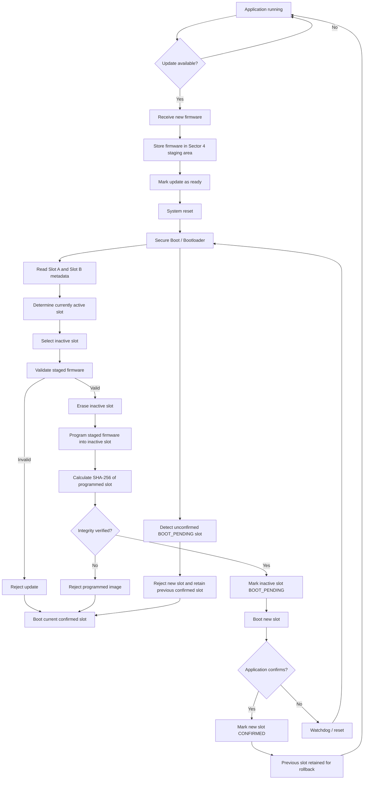

# STM32-Project-05-Secure-Boot

A practical implementation of a Secure Boot and dual-slot firmware update architecture for an STM32F407 embedded system.

The project focuses on firmware integrity verification using SHA-256, firmware metadata validation, secure application handover, A/B firmware slot architecture, and FOTA-oriented update handling.

Digital-signature-based firmware authenticity is planned as a future security extension.

## Project Objective

The goal of this project is to design and implement a secure firmware boot and update mechanism that verifies firmware integrity before execution and supports safer firmware replacement using two independent application slots.

The firmware architecture separates:

* a download/staging area for incoming firmware
* two bootable firmware slots
* slot-specific firmware metadata
* the bootloader responsible for validation, firmware promotion, and boot selection

The implementation is being developed incrementally, with SHA-256-based firmware integrity verification as the current security foundation.

## Secure Boot and Firmware Update Architecture

The system separates update handling from firmware execution:

```text
Application
    |
    | Detect update / receive new firmware
    v
Download / Staging Area
    |
    | Reset after update is ready
    v
Secure Boot / Bootloader
    |
    | Validate staged firmware
    | Determine inactive slot
    | Program inactive slot
    | Verify programmed image
    | Activate new slot
    v
Firmware Slot A or Firmware Slot B
    |
    | Application executes
    |
    +---- If update is available ----+
    |                                |
    +--------------------------------+
```

The running application is responsible for detecting and receiving a new firmware image. The bootloader is responsible for validating the staged image, programming the inactive firmware slot, verifying the programmed image, selecting the new active slot, and controlling the boot decision.

## Flash Memory Architecture

```text
STM32F407 Internal Flash
|
+-- Sector 0-1 : Secure Boot / Bootloader
|
+-- Sector 2   : Slot A Metadata
|
+-- Sector 3   : Slot B Metadata
|
+-- Sector 4   : Download / Staging Area
|
+-- Sector 5   : Firmware Slot A
|
+-- Sector 6   : Firmware Slot B
|
+-- Remaining  : Reserved / available Flash
```

### Slot Roles

Slot A and Slot B are fixed physical firmware locations. Their runtime role changes between firmware updates.

For example:

```text
Initial state

Slot A : Firmware V1  → ACTIVE
Slot B : Empty        → INACTIVE
```

After a successful update:

```text
Slot A : Firmware V1  → Previous / Rollback
Slot B : Firmware V2  → ACTIVE
```

The next update uses the other slot:

```text
Slot A : Firmware V3  → ACTIVE
Slot B : Firmware V2  → Previous / Rollback
```

The system therefore alternates between Slot A and Slot B instead of permanently assigning one slot as "active" and the other as "candidate".

## Download, Validation and Promotion Flow

New firmware is first stored in the dedicated download/staging region.


```mermaid
flowchart TD
    A[Application running] --> B{Update available?}
    B -- No --> A
    B -- Yes --> C[Receive new firmware]
    C --> D[Store firmware in Sector 4 staging area]
    D --> E[Mark update as ready]
    E --> F[System reset]
    
    F --> G[Secure Boot / Bootloader]
    G --> H[Read Slot A and Slot B metadata]
    H --> I[Determine currently active slot]
    I --> J[Select inactive slot]
    
    J --> K[Validate staged firmware]
    K -- Invalid --> L[Reject update]
    L --> M[Boot current confirmed slot]
    
    K -- Valid --> N[Erase inactive slot]
    N --> O[Program staged firmware into inactive slot]
    O --> P[Calculate SHA-256 of programmed slot]
    P --> Q{Integrity verified?}
    
    Q -- No --> R[Reject programmed image]
    R --> M
    
    Q -- Yes --> S[Mark inactive slot BOOT_PENDING]
    S --> T[Boot new slot]
    T --> U{Application confirms?}
    
    U -- Yes --> V[Mark new slot CONFIRMED]
    V --> W[Previous slot retained for rollback]
    W --> A
    
    U -- No --> X[Watchdog / reset]
    X --> G
    G --> Y[Detect unconfirmed BOOT_PENDING slot]
    Y --> Z[Reject new slot and retain previous confirmed slot]
    Z --> M
```

### Update Flow Summary

```text
Application
    |
    | Detect / receive update
    v
Sector 4
Download / Staging
    |
    | Reset
    v
Secure Boot
    |
    | Validate staged firmware
    v
Determine inactive slot
    |
    +----------------------+
    |                      |
    v                      v
Slot A inactive        Slot B inactive
    |                      |
    +----------+-----------+
               |
               v
      Program inactive slot
               |
               v
       Verify SHA-256
               |
               v
          BOOT_PENDING
               |
               v
       Trial boot image
               |
          +----+----+
          |         |
       Confirm    No confirm
          |         |
          v         v
     CONFIRMED    Reset / rollback
```

The finalized design uses the previously confirmed slot as the fallback during trial boot. The new slot does not become the confirmed firmware until the application reaches its defined confirmation point.

## Secure Boot Flow

At every MCU reset, the Secure Boot bootloader evaluates the firmware slot metadata and determines which firmware image is currently selected for execution.

```text
MCU Reset
    |
    v
Secure Boot
    |
    v
Read Slot A metadata
Read Slot B metadata
    |
    v
Determine active slot
    |
    v
Validate selected firmware metadata
    |
    v
Validate application image boundaries
    |
    v
Calculate firmware SHA-256
    |
    v
Compare with stored SHA-256
    |
   +----+
   |    |
 Valid  Invalid
   |      |
   v      v
Boot     Recovery / fallback
selected
slot
```

The bootloader independently calculates the SHA-256 digest of the selected firmware image. The application does not become trusted merely because it provides its own digest.

## Firmware Slot Selection

Slot selection is based on the persisted firmware state, not simply on firmware version.

For example:

```text
Slot A → CONFIRMED
Slot B → BOOT_PENDING
```

means:

```text
Current confirmed firmware = Slot A
Trial firmware             = Slot B
```

A higher version number does not automatically make an image active. A firmware image must complete the defined activation and confirmation flow before becoming the confirmed application.

## Firmware Metadata

Each firmware slot has its own metadata.

```c
typedef struct
{
    uint32_t magic;
    uint32_t image_size;
    uint32_t version;
    uint8_t  sha256[SHA256_DIGEST_SIZE];
    uint32_t update_state;
} firmware_metadata_t;
```

Metadata is associated with the physical slot rather than with a permanent "active" or "candidate" role.

```text
Sector 2 → Slot A Metadata
Sector 3 → Slot B Metadata
```

The metadata describes the firmware image stored in that slot. Fixed slot boundaries remain part of the bootloader and linker memory architecture rather than being duplicated in each metadata record.

## Update State Model

The firmware update state is being designed around the following lifecycle:

```text
EMPTY
  |
  v
PENDING_VALIDATION
  |
  +---- validation failure ----> INVALID
  |
  v
VALIDATED
  |
  v
BOOT_PENDING
  |
  +---- confirmation failure --> INVALID / fallback
  |
  v
CONFIRMED
  |
  v
Previous confirmed slot retained for rollback
```

`BOOT_PENDING` represents a trial firmware image that has been selected for boot but has not yet been confirmed as a known-good application.

The previous confirmed firmware remains available until the new image reaches the confirmation point.

The exact persistent state-transition mechanism and power-loss-safe metadata update strategy are part of the current development work.

## Slot-Specific Firmware Builds

Because Slot A and Slot B are located at different Flash addresses, each slot uses a linker configuration corresponding to its execution address.

```text
Firmware_Slot_A
    FLASH origin = 0x08020000
    VTOR         = 0x08020000

Firmware_Slot_B
    FLASH origin = 0x08040000
    VTOR         = 0x08040000
```

Both slot firmware projects use the same application functionality while being linked for their respective execution locations.

The inactive slot is selected before generating the corresponding firmware image so that the firmware is linked for the address from which it will execute.

## Current Integrity Verification

SHA-256 is used to verify firmware integrity.

The bootloader independently calculates the SHA-256 digest of the firmware image stored in the selected slot and compares it with the reference digest stored in that slot's metadata.

```text
Firmware Image
      |
      v
   SHA-256
      |
      v
Calculated Digest
      |
      +------ Compare ------+
                             |
                    Stored Metadata Digest
```

A digest mismatch causes the firmware image to be rejected rather than executed.

## Implemented Security Features

* STM32 Secure Boot bootloader
* Bootloader/application memory partitioning
* Firmware metadata management
* Application image boundary validation
* Firmware version validation
* SHA-256 implementation
* SHA-256 standard test-vector validation
* SHA-256 validation of firmware stored in STM32 Flash
* Firmware integrity verification
* Secure application handover
* Invalid metadata handling
* Invalid/corrupted firmware handling
* Download/staging area
* A/B firmware slot architecture
* Slot-specific linker configurations
* Slot-specific vector table configuration

## Current Development Focus

The current development phase is focused on completing the production-oriented A/B firmware update mechanism.

Planned implementation steps include:

1. Implement slot-aware firmware metadata
2. Implement persistent update-state handling
3. Determine the active and inactive firmware slots
4. Validate firmware stored in the download/staging area
5. Program the validated firmware into the inactive slot
6. Verify the programmed destination image
7. Implement BOOT_PENDING trial boot handling
8. Implement watchdog-protected firmware confirmation
9. Safely commit the new confirmed slot
10. Implement automatic fallback to the previous confirmed firmware
11. Test reset and power-loss conditions throughout the update flow

## Planned Security Extension

Digital signature verification will be added after the A/B firmware update architecture and update-state handling are completed.

SHA-256 provides firmware integrity verification by detecting changes to the firmware image. Digital signatures will extend the design by providing firmware authenticity and allowing the bootloader to verify that an image was produced by a trusted signing source.

The intended verification flow is:

```text
Downloaded Firmware
        |
        v
Integrity Verification
        |
        v
Digital Signature Verification
        |
        v
Program Inactive Slot
        |
        v
Post-program Verification
        |
        v
Activate Slot
```

## Verification & Testing

Validation is performed incrementally during implementation.

Current verification areas include:

* SHA-256 standard test vectors
* Empty and single-block inputs
* Padding-boundary test cases
* Multi-block SHA-256 inputs
* STM32 Flash image hashing
* Firmware integrity verification
* Firmware metadata validation
* Firmware version comparison
* Application memory boundary validation
* Slot-specific firmware execution
* Vector table configuration
* Invalid/corrupted firmware handling

Future validation will cover:

* Active/inactive slot selection
* Download/staging validation
* Firmware promotion
* Persistent update-state transitions
* BOOT_PENDING handling
* Watchdog-protected confirmation
* Interrupted update recovery
* Power-loss handling
* Automatic fallback
* Post-promotion verification
* Digital signature verification

Test evidence is maintained separately using validation test cases, debugger checkpoints, LED status indication, and screenshots.

## Hardware & Software

* **MCU:** STM32F407
* **Architecture:** ARM Cortex-M4
* **Language:** Embedded C
* **IDE:** STM32CubeIDE
* **Debugging:** ST-LINK / SWD / GDB
* **Build / Image Handling:** STM32CubeIDE build and post-build processing
* **Version Control:** Git / GitHub

## Repository Structure

```text
STM32-Project-05-Secure-Boot/
├── Bootloader/
│   └── Secure_Boot/
│       └── STM32F407 Secure Boot bootloader
├── Firmware_Slot_A/
│   └── Firmware linked for Slot A
├── Firmware_Slot_B/
│   └── Firmware linked for Slot B
├── Docs/
│   └── Project documentation and design notes
├── Validation/
│   └── Test cases, validation results, and evidence
├── LICENSE
└── README.md
```

## Memory Architecture

| Region     |           Address | Purpose            |
| ---------- | ----------------: | ------------------ |
| Sector 0-1 | Bootloader region | Secure Boot        |
| Sector 2   |      `0x08008000` | Slot A metadata    |
| Sector 3   |      `0x0800C000` | Slot B metadata    |
| Sector 4   |      `0x08010000` | Download / staging |
| Sector 5   |      `0x08020000` | Firmware Slot A    |
| Sector 6   |      `0x08040000` | Firmware Slot B    |

## Future Enhancements

* Production-grade persistent update-state handling
* Power-loss-resilient metadata updates
* Candidate validation and firmware promotion
* Watchdog-protected trial boot
* Automatic rollback and recovery
* Digital signature verification
* Authenticated firmware updates
* Automated firmware image generation and validation
* ISO 26262-oriented verification
* Increased unit-test coverage
* Tool-based coverage analysis
